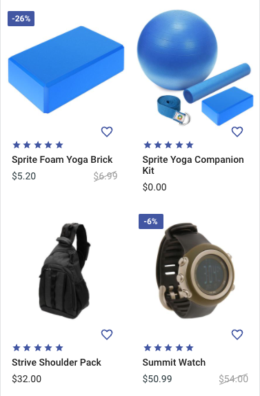
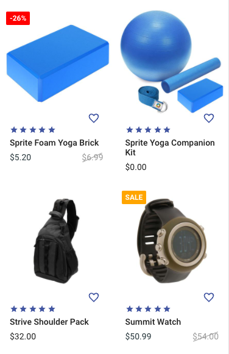
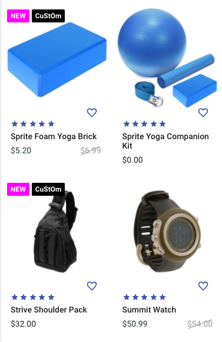
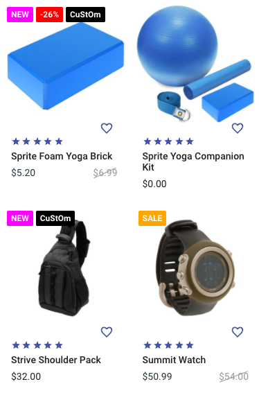

# Demo
## Default configuration



By default the extension will mimic the original discount badges from the core, which will show up from 1% discount.


```json
{
  "badges": [
    {
      "type": "discount"
    }
  ],
  "maxDisplayCount": 3,
  "showOnPdp": true,
  "showOnSliders": true,
  "showOnLists": true,
  "showOnLiveshopping": true,
  "badgeStyle": {}
}
```

## Example #1 (Discounts)



Within this example, discounts between 1% and 10% will be displayed as a text label - not a percentage. This behavior can be achieved by adding a `label` property to the badge configuration.  

Discounts > 10% will be shown as number as usual. The respective limits of the badge configurations are set via `min` and `max` properties. When those are not set, `min` internally defaults to "1", `max` to "100".

Additionally the badges have custom background colors added via the `style` property. So badges can be styled differently for different levels of discount.

```json
{
  "badges": [
    {
      "type": "discount",
      "label": "SALE",
      "max": 10,
      "style": {
        "background": "orange",
      },
    },
    {
      "type": "discount",
      "min": 11,
      "style": {
        "background": "red",
      },
    }
  ],
  "maxDisplayCount": 3,
  "showOnPdp": true,
  "showOnSliders": true,
  "showOnLists": true,
  "showOnLiveshopping": true,
  "badgeStyle": {}
}
```

## Example #2 (Properties)



This example shows a configuration for badges which are based on product properties. Since properties are not added to the product entity data by default, the [@shopgate-project/products-properties](https://github.com/shopgate-professional-services/ext-products-properties) needs to be deployed and configured for the relevant properties.

Property badges can be configured in two different flavors. For the first badge in the configuration down below, the mapped product properties are searched for an exact match of `property` `label` and `value`. When there is a match, a badge with the configured (batch) `label` will be shown.

As an alternative, the batch `label` property can omitted. In that case the product property value will be used for the badge label.

```json
{
  "badges": [
    {
      "type": "property",
      "label": "NEW",
      "properties": [{
        "label": "IsNew",
        "value": "True",
      }],
      "style": {
        "background": "fuchsia",
      },
    },
    {
      "type": "property",
      "properties": [{
        "label": "CustomText",
      }],
      "style": {
        "background": "black",
      },
    }
  ],
  "maxDisplayCount": 3,
  "showOnPdp": true,
  "showOnSliders": true,
  "showOnLists": true,
  "showOnLiveshopping": true,
  "badgeStyle": {}
}
```


## Example #3 (Combined)



This example shows a combination of the previous configurations. As you can see, the discounts are now displayed between new "NEW" and the "CuStOm" badge. So the order of the configurations within the badges array influences the order of the badges.

```json
{
  "badges": [
    {
      "type": "property",
      "label": "NEW",
      "properties": [{
        "label": "IsNew",
        "value": "True",
      }],
      "style": {
        "background": "fuchsia",
      },
    },
    {
      "type": "discount",
      "label": "SALE",
      "max": 10,
      "style": {
        "background": "orange",
      },
    },
    {
      "type": "discount",
      "min": 11,
      "style": {
        "background": "red",
      },
    },
    {
      "type": "property",
      "properties": [{
        "label": "CustomText",
      }],
      "style": {
        "background": "black",
      },
    }
  ],
  "maxDisplayCount": 3,
  "showOnPdp": true,
  "showOnSliders": true,
  "showOnLists": true,
  "showOnLiveshopping": true,
  "badgeStyle": {}
}
```
